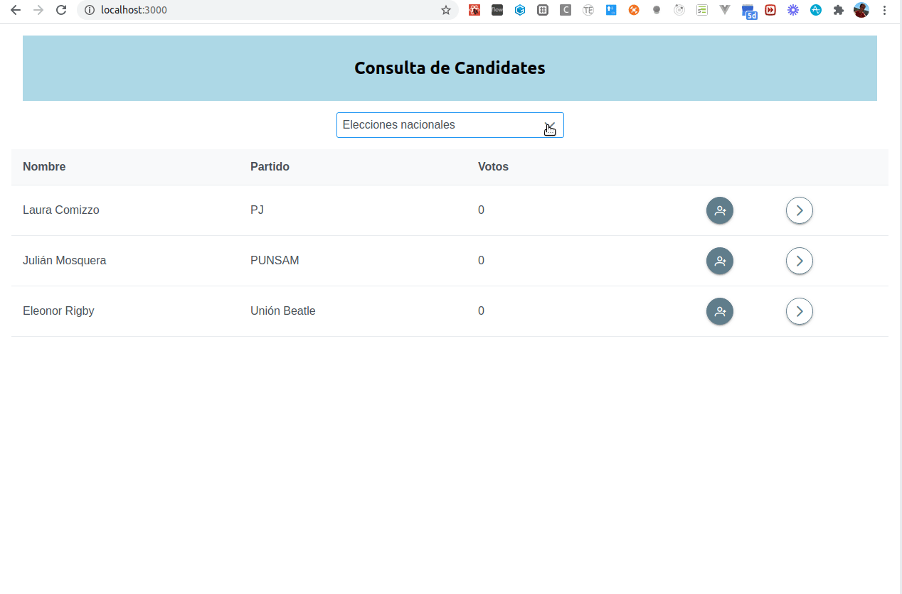
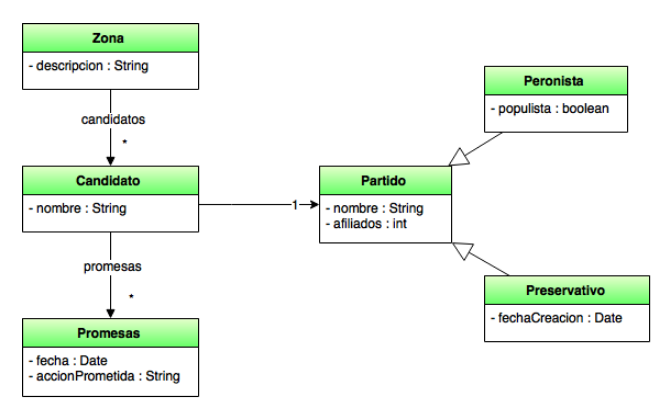

## Ejemplo Politics

En este taller vamos a aprender a mapear un modelo de objetos con su contraparte implementada en un motor de base de datos relacional. En esta primera versión queremos presentar la UI que trabaja con un backend ficticio, para entender la problemática que vamos a resolver y para familiarizarnos con el modelo:

## La aplicación

Se acercan las elecciones, no importa cuando leas ésto. Una empresa que realiza encuestas de intención de voto quiere registrar el grado de popularidad de les candidates en la próxima votación, para lo cual tenemos que seleccionar una zona, que puede ser un partido, una provincia o bien todo el territorio nacional. En cada zona se agrupan los candidates, que pertenecen a un partido político y en los diferentes actos de campaña que ocurren distintos días hacen diversas promesas, que nosotros dejamos registradas.

En la pantalla principal podemos seleccionar la zona de votación, lo que define los candidatos asociados a esa zona. Ordenamos les candidates por votos, y podemos

- registrar la intención de voto de une encuestade, algo que debería disparar una actualización en la base (que no tenemos) y además puede reordenar la lista de candidates
- ver la ficha de un candidate en una ruta aparte, donde podemos adicionalmente agregar nuevas promesas (no borrar por el momento)

## Tareas para el taller

- Nuestra tarea es resolver la comunicación con el backend y el backend mismo, donde deberíamos persistir el siguiente modelo

- cada partido político tiene muchos candidatos, uno para cada zona
- cada candidato pertenece a un solo partido político a la vez
- hay diferentes partidos políticos
  - los peronistas, que pueden ser populistas o no,
  - los que intentan preservar el estado de las cosas, por eso pertenecen al partido “preservativo”,
  - y a futuro pueden incorporarse alianzas, conformadas por distintos partidos políticos.
- cada candidato puede hacer 0, 1 ó más promesas, anotaremos qué prometieron y qué día fue

- Cada candidato pertenece a una zona y a un partido político a la vez. 
- Hay una relación many-to-many entre Zona y Partido (un partido está en varias zonas y en cada zona compiten varios partidos). Candidato termina resultando una entidad asociativa pero ojo, es importante para el negocio.
