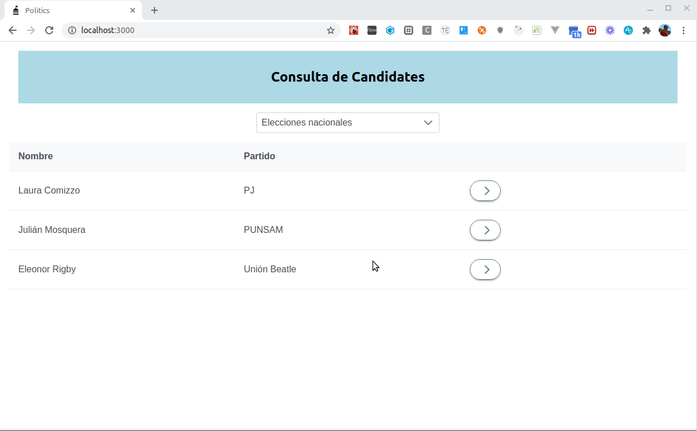

## Ejemplo Politics

En este taller vamos a aprender a mapear un modelo de objetos con su contraparte implementada en un motor de base de datos relacional. En esta primera versión queremos presentar la UI que trabaja con un backend ficticio, para entender la problemática que vamos a resolver y para familiarizarnos con el modelo:

## La aplicación

Se acercan las elecciones, no importa cuando leas ésto. Una empresa que realiza encuestas de intención de voto quiere registrar el grado de popularidad de les candidates en la próxima votación, para lo cual tenemos que seleccionar una zona, que puede ser un partido, una provincia o bien todo el territorio nacional. En cada zona se agrupan los candidates, que pertenecen a un partido político y en los diferentes actos de campaña que ocurren distintos días hacen diversas promesas, que nosotros dejamos registradas.

